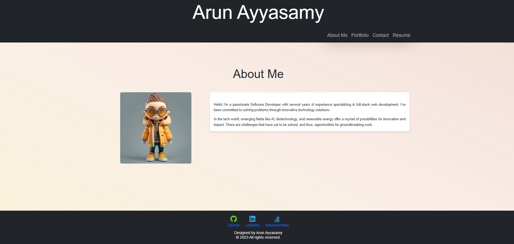
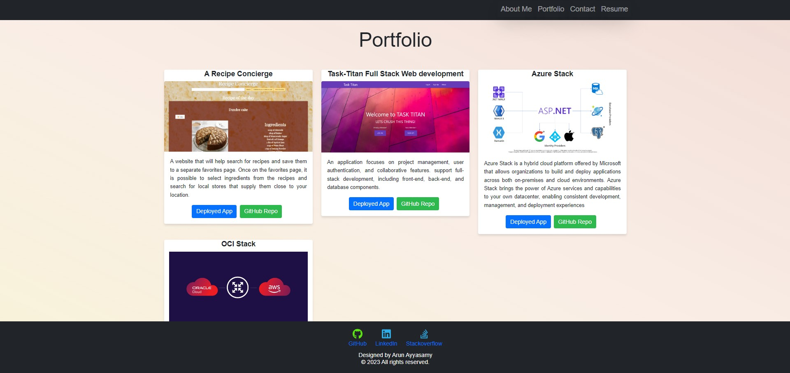
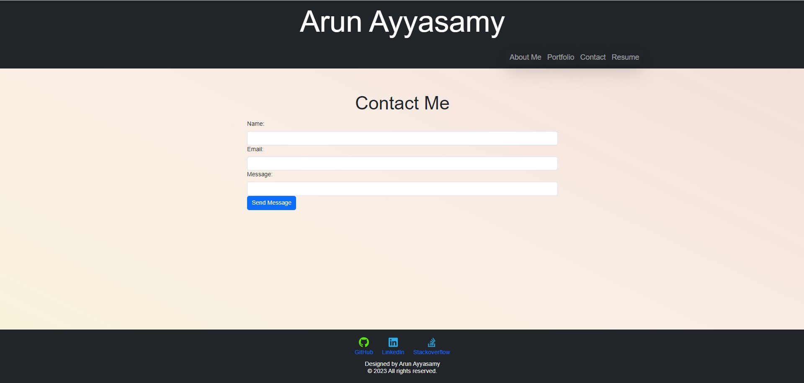
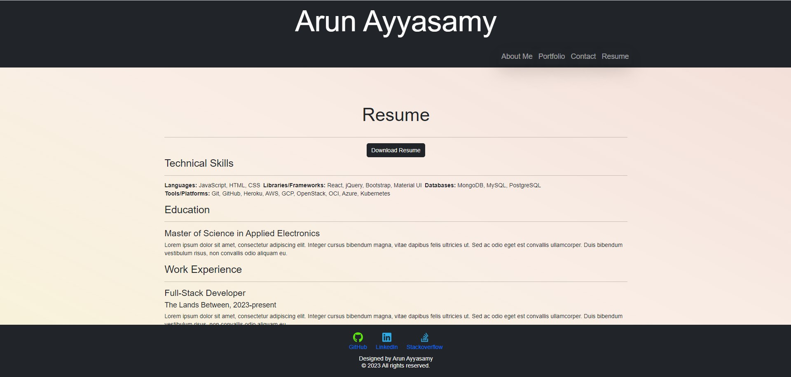

# MyReactPortfolio1.1
[](https://opensource.org/licenses/MIT)

## MyReactPortfolio1.1: Build My Portfolio

Welcome to my portfolio repository! This project serves as a comprehensive showcase of my skills, experiences, and projects as a Software Developer.
From web development and machine learning to graphic design, this portfolio encompasses the wide array of disciplines I've ventured into.

---
#### **Features:**

- **About Me**: A section to get to know me better, my background, and what I'm passionate about.
- **Skills**: An overview of my technical and soft skills.
- **Projects**: Case studies and code snippets of projects I've worked on.
- **Experience**: My professional experience timeline.
- **Contact**: A form to reach out to me.

  ## Table of Contents
  - [Technologies Used](#TechnologiesUsed)
  - [How to Run Locally](#usage)
  - [Packages Used](#package-list)
  - [Deployed Link](#deployed-link)
  - [Sample Application](#sample-application)
  - [License](#license)
  - [Questions](#questions)

## Technologies Used <a name="TechnologiesUsed"></a>

- React.js
- React-Bootstrap
- CSS/SASS
- GitHub Pages for Deployment

## How to Run Locally <a name="usage"></a>

1. **Clone the Repository**

   ```
   git clone https://github.com/yourusername/your-repo-name.git
   ```

2. **Navigate to the directory**

   ```
   cd your-repo-name
   ```

3. **Install dependencies**

   ```
   npm install
   ```

4. **Run the development server**

   ```
   npm start
   ```

Now, the app should be running on [http://localhost:3000/](http://localhost:3000/).

## Packages Used <a name="package-list"></a>

1. **React and ReactDOM**: You are using React 18.2.0 for building the UI of your application. ReactDOM is used for rendering React components to the DOM.
   - `"react": "^18.2.0"`
   - `"react-dom": "^18.2.0"`

2. **React Router DOM**: Provides routing capabilities to your React application.
   - `"react-router-dom": "^6.2.1"`

3. **React Bootstrap and Bootstrap**: React-Bootstrap is a library of reusable front-end components.
   - `"react-bootstrap": "^2.7.2"`
   - `"bootstrap": "^5.3.0-alpha3"`

4. **FontAwesome**: Font Awesome provides scalable vector icons that can be customized with CSS. The various FontAwesome packages for solid and brand icons, as well as the core FontAwesome SVG and Font.
   - `"@fortawesome/fontawesome-free": "^6.4.0"`
   - `"@fortawesome/fontawesome-svg-core": "^6.4.0"`
   - `"@fortawesome/free-brands-svg-icons": "^6.4.0"`
   - `"@fortawesome/free-solid-svg-icons": "^6.4.0"`
   - `"@fortawesome/react-fontawesome": "^0.2.0"`

5. **Testing Libraries**: These are used for writing tests for your React components.
   - `"@testing-library/jest-dom": "^5.16.5"`
   - `"@testing-library/react": "^13.4.0"`
   - `"@testing-library/user-event": "^13.5.0"`

6. **Web Vitals**: Library for measuring web vitals, which are important quality signals defined by Google.
   - `"web-vitals": "^2.1.4"`

7. **Others**: 
   - `"font-awesome": "^4.7.0"` 
   - `"react-fontawesome": "^1.7.1"` 

### Dev Dependencies

1. **GH-Pages**: Used for deploying your app to GitHub Pages.
   - `"gh-pages": "^5.0.0"`

2. **Interpolate HTML Plugin**: Typically used for injecting variables into your HTML.
   - `"interpolate-html-plugin": "^4.0.0"`

3. **Plugin Proposal Private Property In Object**: A Babel plugin for private property in objects.
   - `"plugin-proposal-private-property-in-object": "^7.16.7"`

## Deployed Link <a name="deployed-link"></a>

Deployed Application in GitHub : https://arundvp.github.io/MyReactPortfolio1.1/

## Sample Application <a name="sample-application"></a>

  
  
  
  
  
  
## License <a name="license"></a>
  This project is licensed under the MIT license.
  https://opensource.org/licenses/MIT

## Questions <a name="questions"></a>
If you have any questions, please contact me at arun@arun.com.

My GitHub profile is [arundvp](https://github.com/arundvp).